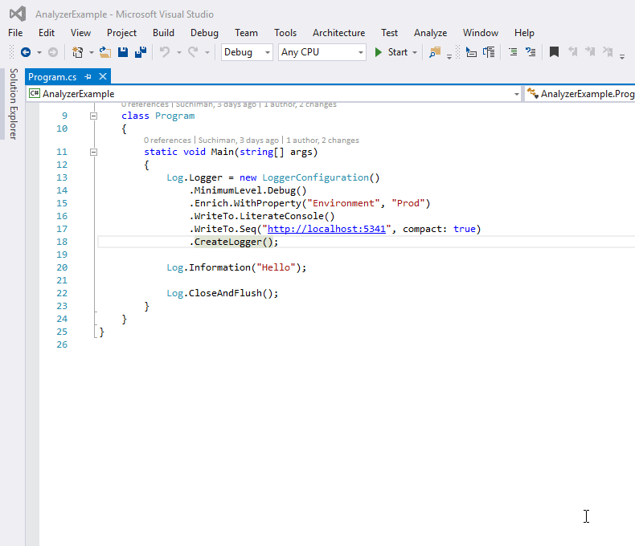

# SerilogAnalyzer

Roslyn-based analysis for code using the [Serilog](http://serilog.net) logging library. Checks for common mistakes and usage problems.


## Installing (Visual Studio)

You can get the SerilogAnalyzer from various sources:
- Grab the VSIX from the [releases list](https://github.com/Suchiman/SerilogAnalyzer/releases).
- Install it from [Visual Studio Gallery](https://marketplace.visualstudio.com/items?itemName=Suchiman.SerilogAnalyzer).
- Install the [NuGet package](https://www.nuget.org/packages/SerilogAnalyzer) into your project.

## Analyses

### `Serilog001`: Exception Usage

Checks that exceptions are passed to the `exception` argument, and not as a normal property, with a code fix to correct it.

**Detected incorrect usage:**

```csharp
catch (Exception ex)
{
   Log.Error("Could not save {File}: {Error}", file, ex);
}
```

The `ex` parameter is an exception, which Serilog has special handling for if passed as the first argument.

**Correct usage:**

```csharp
catch (Exception ex)
{
   Log.Error(ex, "Could not save {File}", file);
}
```

### `Serilog002`: Message Template Syntax Verifier

Checks message templates for correct syntax and emits an error if there's a violation of the templating syntax.

**Detected incorrect usage:**

```csharp
Log.Information("Saving {File to {Directory}", file, directory);
```

The first property token in the message template, `File`, is malformed.

**Correct usage:**

```csharp
Log.Information("Saving {File} to {Directory}", file, directory);
```

### `Serilog003`: Property Binding Verifier

Checks coherence between the message template tokens and the supplied arguments.

**Detected incorrect usage:**

```csharp
Log.Information("Saving {File} to {Directory}", file);
```

Here the number of arguments passed to the method (1) is less than the number of tokens in the message template (2), so the second token in the message template, `{Directory}`, will have no value.

**Correct usage:**

```csharp
Log.Information("Saving {File} to {Directory}", file, directory);
```

Each property named in the message template needs to correspond to exactly one argument.

### `Serilog004`: Constant Message Template Verifier

Checks that message templates are constant strings. This ensures that events with different data/format arguments can still be detected as instances of the same event.

**Detected incorrect usage:**

```csharp
var errorMessage = TryToCheckOutOrder(...); // etc.
Log.Error(errorMessage);
```

Because `errorMessage` generally contains failure-specific text (`"Couldn't find order 123"` ... then `124`, then `125`) the group of occurrences can't be located using the message template/event type.

This also degrades Serilog performance by filling its internal message template cache.

**Correct usage:**

```csharp
Log.Error("Order handler failed with {HandlerError}", errorMessage);
```

Correct usage is to always pass any variable data as a property to a message template.
A CodeFix is provided that converts string interpolation (`$"{...}"`), `String.Format(...)` and string concat (`"value: " + value`) to a message template

### `Serilog005`: Unique Property Name Verifier

Checks that all property names in a message template are unique.

**Detected incorrect usage:**

```csharp
Log.Information("Saving {Path} to {Path}", file, directory); 
```

In this example, because both properties in the message template have the same name, Serilog can only record one of them.

**Correct usage:**

```csharp
Log.Information("Saving {File} to {Directory}", file, directory); 
```

Each property in a message template must have a unique name.

### `Serilog006`: Pascal Cased Property Verifier

Checks that all property names in a message template are PascalCased.

**Detected incorrect usage:**

```csharp
Log.Information("Saving {file} to {directory}", file, directory); 
```

A CodeFix is provided, that applies pascal casing.

**Correct usage:**

```csharp
Log.Information("Saving {File} to {Directory}", file, directory); 
```

### `Serilog007`: Anonymous objects use destructuring Verifier

Checks that all anonymous objects passed to the logger are destructured.

**Detected incorrect usage:**

```csharp
Log.Information("Saving {File} to {Directory}", new { Name = name, Size = size }, directory); 
```

A CodeFix is provided, that applies the destructuring hint.

**Correct usage:**

```csharp
Log.Information("Saving {@File} to {Directory}", new { Name = name, Size = size }, directory); 
```

### `Serilog008`: Correct contextual Logger Verifier

Checks that contextual loggers are constructed with the correct type.

**Detected incorrect usage:**

```csharp
class A
{
    private static readonly ILogger Logger = Logger.ForContext<B>();
}

class B {}
```

A CodeFix is provided, that uses the correct type.

**Correct usage:**

```csharp
class A
{
    private static readonly ILogger Logger = Logger.ForContext<A>();
}

class B {} 
```

## Refactors
Performs static analysis on a fluent LoggerConfiguration call to generate configuration for use with either [`<appSettings>`](https://github.com/serilog/serilog-settings-appsettings) or [`appSettings.json`](https://github.com/serilog/serilog-settings-configuration)


